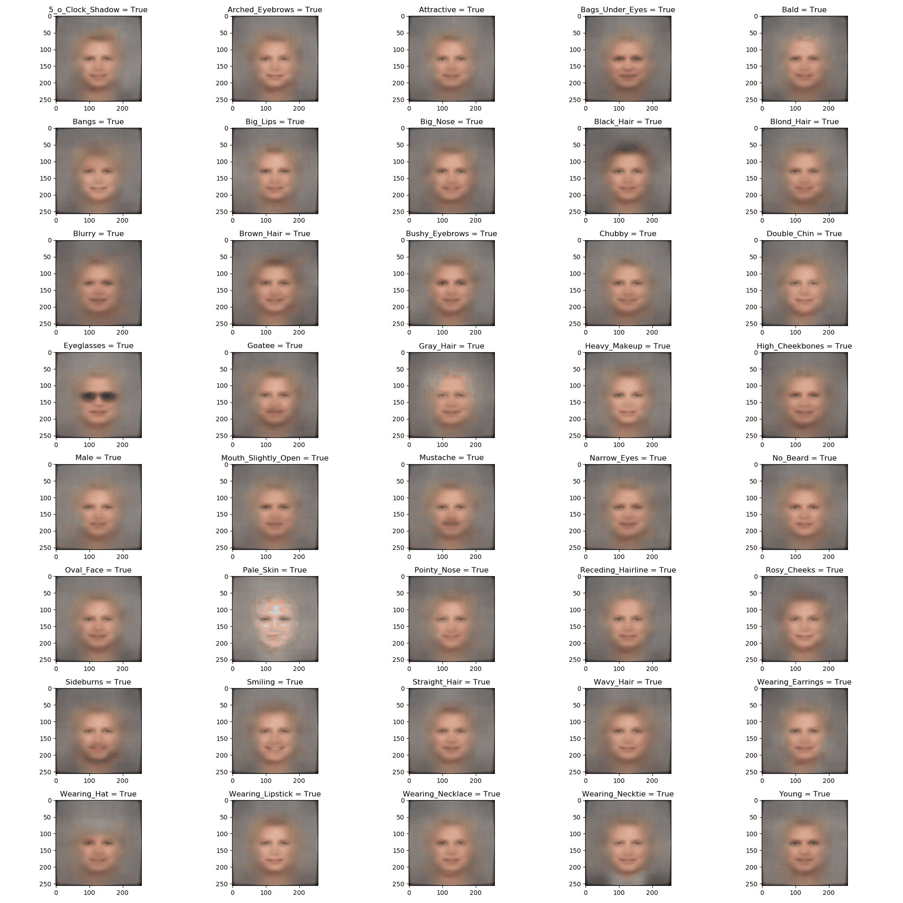

# deepgen

*Deep convolutional neural networks for generative modeling (i.e. VAEs, GANs, etc.)*

## Requirements
Tested with:
- python==3.7
- torch==1.3
- torchvision==0.4
- numpy==1.16
- matplotlib==3.1
- pandas==0.25

All dependencies are listed in `environment.yml`.

## Installation
1. Install dependencies: `conda env create -f environment.yml`
2. Install with setup.py: `python setup.py install` (replace `install` with `develop` to have code changes take immediate effect)

## Usage
Run `python cnn/run_vae.py -h` to see a list of available arguments.

### Train ResNet-style (Conditional) Variational Autoencoder:
- `python cnn/run_vae.py --train --save_examples`

### Test Trained Model:
- `python cnn/run_vae.py --test --save_examples --model_path /path/to/model`

*Note:* be careful to set `--report_freq` and `--batch_size` properly. The former specifies how often to save examples and report losses (i.e. controls how spammy the output is), while the latter specifies how many examples will be batched together and must be appropriate for your computational and memory resources (I like batch size 1 for local development and use batch size 32 on a GPU,  but for performance the largest possible batch size is best).

### Play with Conditional Attributes

CelebA gives us access to 40 attributes (e.g. '5_o_Clock_Shadow', 'Arched_Eyebrows') which we have concatenated with the latent vector during training. By changing these attributes manually, we can have a bit of fun tweaking faces. To try this, run:
- `python cnn/toggle_attributes.py --img_path ... --model_path ...`

Note that I have set defaults for all of the attributes because checking every combination would require 2^40 forward passes and is thus prohibitively expensive. The script iterates over each attribute and flips them on/off and outputs the results side-by-side. Below is an example I generated using my own profile photo.

I have compiled all of the positive changes (i.e. attributes = `True`) into the figure below; the only change between the two frames of the GIF is the value of the default attribute of "Smiling" (to show how default attributes affect the image globally).

## References
- [Deep Conditional Generative Models](https://pdfs.semanticscholar.org/3f25/e17eb717e5894e0404ea634451332f85d287.pdf)
